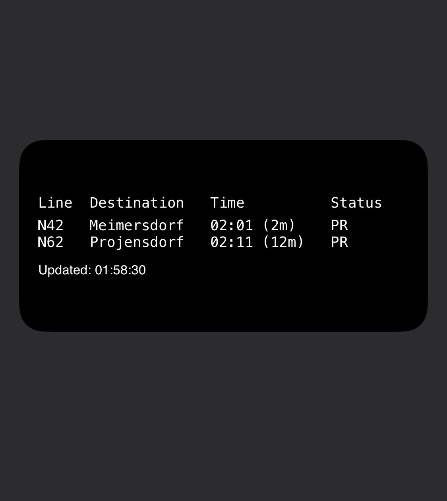

# KVG Real-time Bus Information Widget

This is a Scriptable widget for displaying real-time bus information in Kiel. It helps you check the real-time arrival information for specified bus stops.



## Installation Steps

1. Install [Scriptable](https://apps.apple.com/app/scriptable/id1405459188) app on your iOS device
2. Download the `displayboard.js` file
3. Import the file into the Scriptable app
4. Add a Scriptable widget to your iOS home screen and select this script

## Configuration

You can modify the following parameters in the configuration section at the beginning of the script:

```javascript
// Stop ID
const stopId = "1643"

// Maximum number of entries to display
const maxEntries = 6

// Maximum characters for destination
const maxChars = 14
```

## Display Information

The widget displays the following information:

- Line: Bus line number
- Destination: Final stop
- Time: Estimated arrival time and countdown
- Status: Current status
  - P: Planned
  - PR: Predicted
  - S: Stopping
  - D: Departed

## API Data Format

The widget uses KVG's API to fetch data. Here's an example of the returned data format:

```json
{
  "actual": [
    {
      "patternText": "11",      // Line number
      "direction": "Central Station",   // Destination
      "actualTime": "14:30",   // Estimated arrival time
      "actualRelativeTime": 180, // Relative time (seconds)
      "status": "PREDICTED"    // Status
    }
  ]
}
```

## Notes

- Ensure your device has a stable network connection
- The stop ID must be a valid KVG stop number
- It is recommended to set the widget to medium size for optimal display