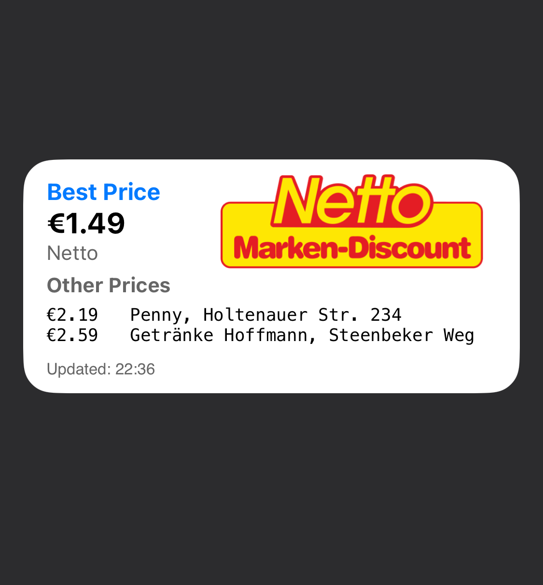

# YouPicKit Price Tracking Widget

Price tracking widget for German supermarkets based on YouPicKit, displaying the lowest price and other pricing information for specified products in nearby supermarkets.



## Configuration

In the `pricetracking.js` file, you can customize the following configurations through the `CONFIG` object:

### UI Configuration
```javascript
ui: {
  bgColor: "#FFFFFF",      // Background color
  fonts: {                 // Font settings
    line: "Menlo",         // Price list font
    footer: "Helvetica",   // Footer update time font
    error: "Helvetica-Bold" // Error message font
  },
  colors: {               // Color settings
    primary: "#007AFF",   // Primary text color
    text: "#000000",      // Normal text color
    secondary: "#666666", // Secondary text color
    error: "#FF0000"      // Error message color
  },
  layout: {               // Layout settings
    priceWidth: 8,        // Price display width
    addressWidth: 35,     // Address display width
    maxEntries: 3         // Maximum price entries to display
  }
}
```

### Location Configuration
```javascript
location: {
  latitude: "54,35",    // Latitude
  longitude: "10,12",   // Longitude
  perimeter: "5",       // Search radius (kilometers)
  address: "Kiel"       // City name
}
```

### Product Configuration
```javascript
productUrl: "https://www.youpickit.de/Produkt/..."  // YouPicKit product page URL
```

## Usage Instructions

1. Create a new script in Scriptable
2. Copy the content of `pricetracking.js` into the new script
3. Modify configuration parameters as needed
   - Update location information to match your location
   - Update product URL to the item you want to track
4. Add the widget to your home screen
   - Choose medium-size widget
   - Select this script

## Important Notes

- Product URL must be a valid YouPicKit product page address
- Location information should be within Germany
- Search radius should be set within a reasonable range (e.g., 5-10 kilometers)
- Widget requires network connection to fetch latest price information